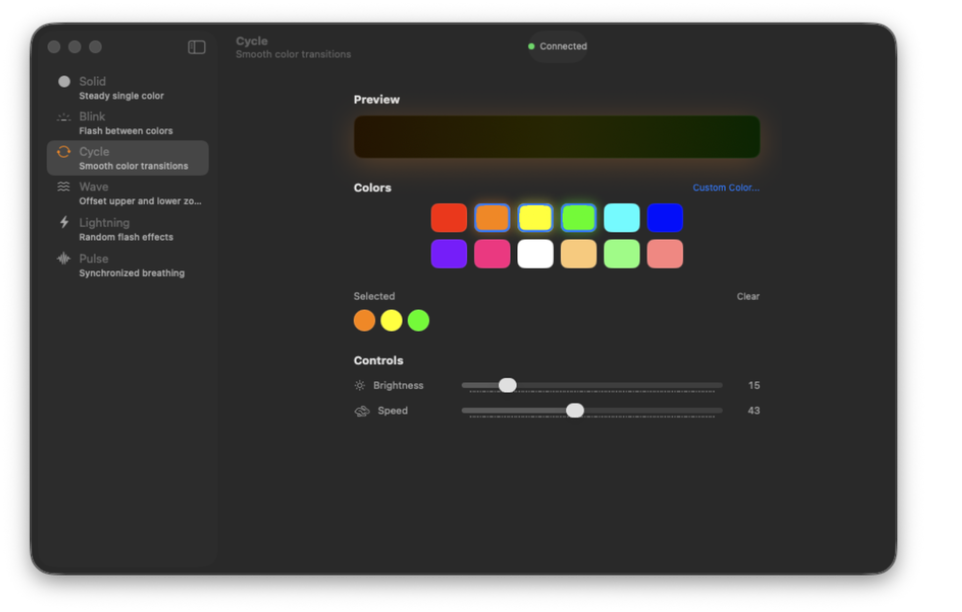

# QuadcastRGB2App

[](https://github.com/mscno/QuadcastRGB2S/actions/workflows/ci.yml)

Control HyperX microphone lighting from macOS or the command line.

The **macOS menu bar app controls the QuadCast 2S**. It has six lighting modes,
upper/lower lighting zones, a ten-color palette, brightness and animation controls,
and optional launch at login. Its interface uses native macOS Liquid Glass.


The C CLI retains support for QuadCast S and DuoCast; QuadCast 2S uses hidapi on macOS.

## macOS app

Requires **macOS 26 or later on Apple Silicon**. Release DMGs bundle hidapi;
people installing a release do not need Homebrew.

Download a signed DMG from [Releases](https://github.com/mscno/QuadcastRGB2S/releases),
open it, and drag `QuadcastRGBApp` into Applications. Only releases that pass
Developer ID signing, Apple notarization and Gatekeeper checks are distributed.

macOS requires **Input Monitoring** to access the microphone's HID controller.
Allow QuadCast RGB in **System Settings → Privacy & Security → Input Monitoring**,
then click Reconnect. The app does not capture audio or listen to keystrokes.

### Build from source

Install Xcode 26 or later and the build dependencies:

```sh
brew install hidapi pkg-config
bash scripts/build-app.sh
```

The local preview is `dist/preview/QuadcastRGBApp.app`. It is ad-hoc signed and is
intended for development. For a preview DMG, install `dmgbuild==1.6.7` in a Python
virtual environment and run:

```sh
bash QuadcastRGBApp/scripts/package-dmg.sh --skip-notarize
```

For signed releases, credentials, CI artifacts and draft releases, see
[the release guide](docs/RELEASING.md).

### Tests

```sh
make test-sanitize
swift test --arch arm64
python3 -m unittest discover -s tests/release -v
xcodebuild test -project QuadcastRGBApp/QuadcastRGBApp.xcodeproj \
  -scheme QuadcastRGBApp -configuration Debug \
  -destination 'platform=macOS,arch=arm64' \
  -derivedDataPath .build/DerivedData-test \
  -only-testing:QuadcastRGBAppUITests CODE_SIGN_IDENTITY=-
```

Animation and worker tests run without a microphone. UI tests use an isolated
preview state and never change microphone lighting or saved settings. CI checks
the CLI on Linux/macOS and the app on macOS 26, including UI screenshot attachments
and a self-contained release-bundle/DMG check. Each successful CI run uploads
a development DMG named `QuadcastRGB2S-AppleSilicon-preview`; signed distribution
is prepared by the separate release workflow.

## CLI

Modes: `solid`, `blink`, `cycle`, `wave`, `lightning`, `pulse`.

On macOS:

```sh
brew install libusb hidapi pkg-config
make quadcastrgb
./quadcastrgb --help
./quadcastrgb solid ff0000
```

On Debian/Ubuntu:

```sh
sudo apt-get install build-essential pkg-config libusb-1.0-0-dev
make quadcastrgb
```

`make install` installs to `$HOME/.local/bin` and `$HOME/.local/share/man/man1`.
Override `BINDIR_INS` and `MANDIR_INS` to change the destination. Linux requires
permission to access the USB device; see [the upstream CLI project](https://github.com/Ors1mer/QuadcastRGB)
for udev and distribution packaging guidance.

```sh
./quadcastrgb -u solid 4c0099 -l solid ff6000
./quadcastrgb -u -b 50 cycle -l lightning ff6000
```

The CLI runs continuously; stop it with Ctrl-C on macOS. Linux daemon behavior
comes from the upstream project. Multiple microphones and FreeBSD support are
not covered by this repository's CI.

## Credits and license

Based on [Ors1mer/QuadcastRGB](https://github.com/Ors1mer/QuadcastRGB) and
[j-muell/QuadcastRGB2S](https://github.com/j-muell/QuadcastRGB2S).
Licensed under [GPL-2.0-only](LICENSE).
